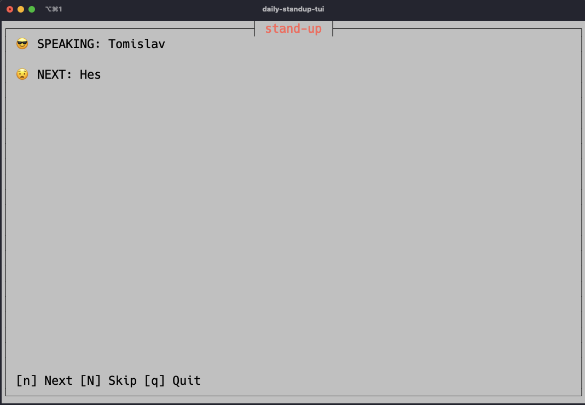

# daily-standup-tui

My first pet project written in Rust and Cursive. Code probably is shit :-)

## Introduction

A scrum stand-up application that you can use every morning to share your daily with the rest of the team.

> Note: Image taken from iTerm2 using hack nerd font
 
The application stores its configuration under your `home_folder/.daily-standup-tui/.config.toml`

## Features

- Add/Delete developers for daily
- Skip/Finish turn

## Planned features

- Confirm action when removing developer from the list
- Configurable countdown timer

## Maybe in the future

- Light/Dark theme

## If you have money to throw

